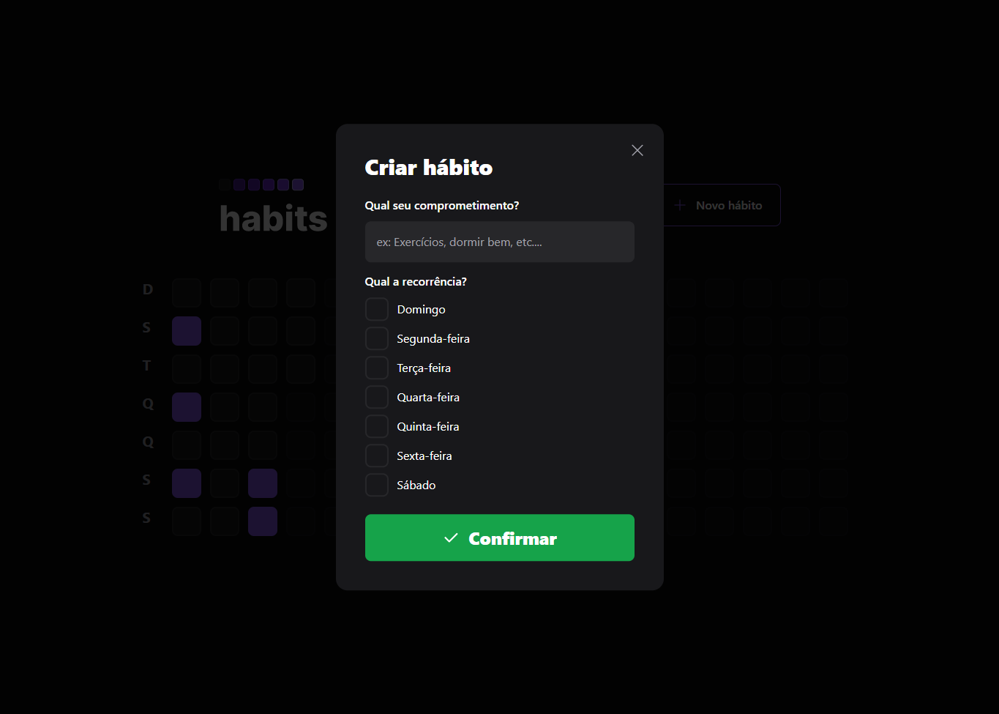
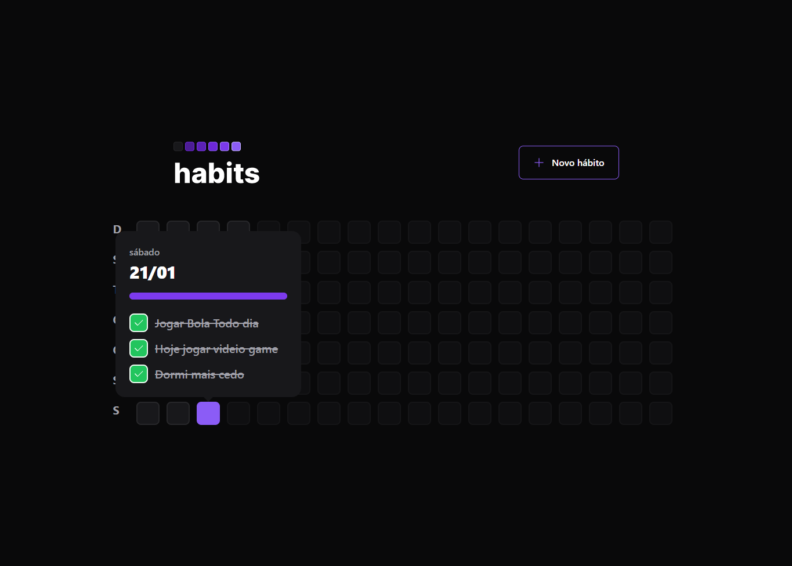

# Habits 

## 👨‍💻Tecnologia Back End
- Fastify 
- Prisma
- Zod
- dayjs    

## 👨‍💻Tecnologia Front End
 - Tailwindcss
 - Axios 
 - Reactjs com typescript
 -dayjs 
 - clx

## Instalação da Tecnologia Front End
 - npm i axios 
 - npm install -D tailwindcss postcss autoprefixer
 - radix
 - npm i dayjs  
 - npm i clx 
 
## Instalação da Tecnologia Back End
 - nodejs typescript
 - npm i fastify 
 - npm i prisma -D 
 - npm i @fastify/cors
 - npm i prisma-erd-generator @mermaid-js/mermaid-cli -D
 - npm i @prisma/client
 - npx prisma generate
 - npx prisma init --datasource-provider SQLite
 - npm i zod
 - npx prisma studio 

 ## 💛 Contato
 arthursousarabelo2@gmail.com
 
